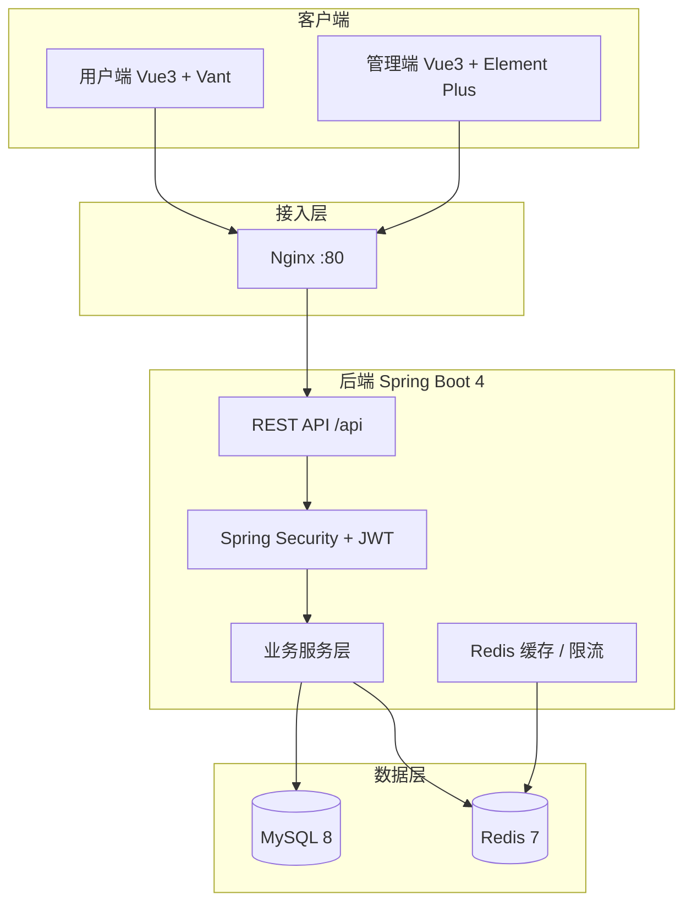

# 酒店预订管理系统

对标同程旅行酒店模块的 Java 全栈项目，包含用户端与管理端。

## 架构概览



## 技术栈

| 层级 | 技术 |
|------|------|
| 后端 | Spring Boot 4 · Java 17 · MyBatis-Plus · Spring Security |
| 数据库 | MySQL 8 · Flyway · Redis 7 |
| 管理端 | Vue 3 · Vite · Element Plus |
| 用户端 | Vue 3 · Vite · Vant |
| 文档 | SpringDoc OpenAPI (Swagger UI) |
| 工程化 | JUnit 5 · MockMvc · Spotless · Checkstyle · GitHub Actions · Docker |

## 一键启动（Docker 全栈）

启动 MySQL、Redis、后端应用与 Nginx 网关：

```bash
docker compose up -d --build
```

| 服务 | 说明 |
|------|------|
| Nginx | http://localhost （API 代理至 `/api/`） |
| 健康检查 | http://localhost/api/health |
| Swagger | http://localhost/api/swagger-ui.html |

停止并清理：

```bash
docker compose down
```

## 本地开发启动

### 1. 启动中间件（仅 MySQL + Redis）

```bash
docker compose -f docker-compose.dev.yml up -d
```

> **端口说明**：Docker MySQL 映射到 **3308**，避免与本机 3306 冲突。也可直接使用本机 MySQL，在 `.env` 中设置 `DB_PORT=3306`。

### 2. 启动后端

```bash
./mvnw spring-boot:run
```

- API 根路径：`http://localhost:8080/api`
- 健康检查：`http://localhost:8080/api/health`
- Swagger：`http://localhost:8080/api/swagger-ui.html`

### 3. 启动前端

```bash
# 用户端 (端口 5173)
cd user-web && npm install && npm run dev

# 管理端 (端口 5174)
cd admin-web && npm install && npm run dev
```

## 演示账号

| 端 | 手机号 | 密码 | 角色 |
|----|--------|------|------|
| 管理端 | 13800000000 | admin123 | ADMIN |
| 商家端 | 13800000001 | merchant123 | MERCHANT |

用户端请自行注册，或使用 Swagger 调用 `POST /api/auth/register`。

> API 返回的手机号已脱敏（中间四位 `****`），如 `138****0000`。

## 环境变量

复制 `.env.example` 为 `.env` 并按需修改：

```
DB_HOST=localhost
DB_PORT=3308
DB_NAME=hotel_db
DB_USER=root
DB_PASSWORD=root
REDIS_HOST=localhost
REDIS_PORT=6379
```

## 测试与代码规范

```bash
# 单元测试 + 集成测试
./mvnw test

# 代码格式化检查（Spotless）
./mvnw spotless:check

# 自动格式化
./mvnw spotless:apply

# Checkstyle 规范检查
./mvnw checkstyle:check

# 完整构建（含规范校验）
./mvnw verify
```

### 测试覆盖（核心流程）

| 类型 | 覆盖范围 |
|------|----------|
| 单元测试 | 订单创建、库存扣减/释放、退款金额计算、手机号脱敏 |
| 集成测试 | MockMvc：认证、酒店搜索、订单创建/支付/取消 |

## 项目结构

```
hotel-reservation-system/
├── src/                      # Spring Boot 后端
├── src/test/                 # 单元测试与 MockMvc 集成测试
├── admin-web/                # 管理端前端
├── user-web/                 # 用户端前端
├── docker/                   # Nginx 等 Docker 配置
├── config/checkstyle/        # Checkstyle 规则
├── .github/workflows/        # GitHub Actions CI
├── Dockerfile                # 后端镜像
├── docker-compose.yml        # 全栈一键启动
├── docker-compose.dev.yml    # 本地开发中间件
└── .env.example
```

## 开发进度

- [x] 第 0 周：工程骨架、统一返回、Swagger、双前端脚手架
- [x] 第 1–2 周：用户认证与权限（注册/登录/JWT/双端登录）
- [x] 第 3 周：酒店域（搜索/详情/房型/审核）
- [x] 第 4 周：库存日历、下单、模拟支付、订单管理
- [x] 第 5–6 周：双端前端完善与联调
- [x] 第 7 周：评价、收藏、Banner、优惠券、操作审计
- [x] 第 8 周：工程化（测试/CI/Docker/脱敏/代码规范）
- [ ] 第 9–10 周：部署与作品集

### 第 8 周功能（工程化）

| 模块 | 功能 |
|------|------|
| 单元测试 | 订单创建、库存扣减、退款计算 |
| 集成测试 | MockMvc 核心 API（认证/酒店/订单） |
| 代码规范 | Spotless 格式化 + Checkstyle 静态检查 |
| CI | GitHub Actions：push 时跑规范检查、测试与构建 |
| Docker | Dockerfile + docker-compose（MySQL/Redis/App/Nginx） |
| 脱敏 | 手机号中间四位 `****` |
| 文档 | 架构图、一键启动、演示账号 |

### 第 7 周增强（Redis / 限流 / 审计）

| 模块 | 功能 |
|------|------|
| Redis 缓存 | Banner 列表、城市列表缓存；管理端改 Banner 自动失效 |
| 定时任务 | 待支付订单超时（默认 30 分钟）自动取消并释放库存/优惠券 |
| 接口限流 | 登录接口按 IP+手机号限流（默认 5 次/分钟） |
| 工程化 | 请求日志（traceId）、全局异常补全、Swagger JWT 认证 |
